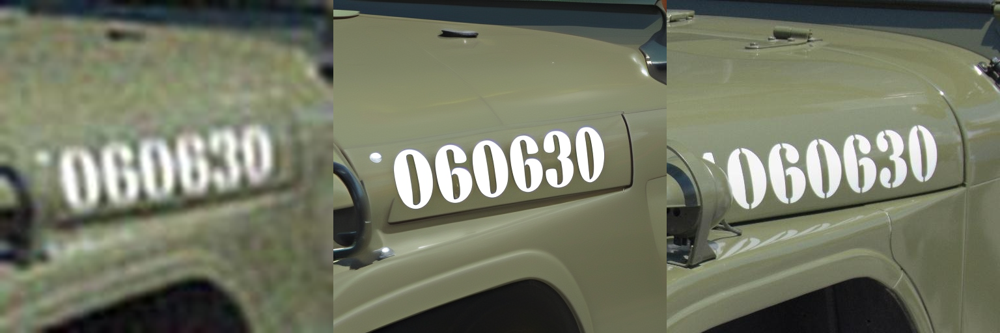

# 运行环境搭建
build_env.sh
```
export https_proxy='10.249.36.23:8243'
conda create -n tair-cuda12 python=3.10 -y
conda activate tair-cuda12
pip install torch==2.2.2 torchvision==0.17.2 torchaudio==2.2.2 --index-url https://download.pytorch.org/whl/cu121

pip install -r requirements.txt

export CC=gcc-9
export CXX=g++-9
cd detectron2 
pip install -e .
cd ..
cd testr 
pip install -e .
```
# 运行脚本
原始代码中的推理代码：val.py，会将所有图片都resize成128x128的大小，得到结果非常差。
新增了一个val_patches.py，可以将图片分成patchs，然后patchs-level推理，最后拼接结果。可以得到较好的结果。
```
sh run_val.sh
```


<div align="center">
<h1>
Text-Aware Image Restoration with Diffusion Models</h1>

[**Jaewon Min**](https://github.com/Min-Jaewon/)<sup>1*</sup>, 
[**Jin Hyeon Kim**](https://github.com/jinlovespho)<sup>2*</sup>, 
**Paul Hyunbin Cho**<sup>1</sup>, 
[**Jaeeun Lee**](https://github.com/babywhale03)<sup>3</sup>,
**Jihye Park**<sup>4</sup>, 
**Minkyu Park**<sup>4</sup>, <br>
**Sangpil Kim**<sup>2&dagger;</sup>, 
**Hyunhee Park**<sup>4&dagger;</sup>, 
[**Seungryong Kim**](https://scholar.google.com/citations?hl=zh-CN&user=cIK1hS8AAAAJ)<sup>1&dagger;</sup>

<sup>1</sup> KAIST&nbsp;AI ·
<sup>2</sup> Korea&nbsp;University ·
<sup>3</sup> Yonsei&nbsp;University ·
<sup>4</sup> Samsung&nbsp;Electronics

<sup>*</sup> Equal contribution. <sup>&dagger;</sup>Co-corresponding author.

<a href="https://arxiv.org/abs/2506.09993"></a>
        <a href="https://cvlab-kaist.github.io/TAIR/"></a>
        <a href="https://huggingface.co/datasets/Min-Jaewon/SA-Text"></a>
        <a href="https://huggingface.co/datasets/Min-Jaewon/Real-Text"></a>
</div>


## 📢 News 
- 🌈 **2025.06.24** - TAIR Demo code released!
- ❤️ **2025.06.23** - Training code released!
- 🤗 **2025.06.19** — **SA-Text** and **Real-Text** datasets are released along with the [dataset pipeline](https://github.com/paulcho98/text_restoration_dataset/tree/main)!
- 📄 **2025.06.12** — Arxiv paper is released! 
- 🚀 **2025.06.01** — Official launch of the repository and project page!
---


## 💾 SA-Text Dataset
**SA-Text** is a newly proposed dataset for **Text-Aware Image Restoration (TAIR)** task. It is built from  **SA-1B** dataset using our [dataset pipeline](https://github.com/paulcho98/text_restoration_dataset/tree/main) and  consists of **100K** image-text instance pairs with detailed scene-level annotations.
**Real-Text** is an evaluation dataset for real-world scenarios. It is constructed from [RealSR](https://github.com/csjcai/RealSR) and [DrealSR](https://github.com/xiezw5/Component-Divide-and-Conquer-for-Real-World-Image-Super-Resolution) using same pipeline as above.


### Dataset Preparation

| Split             | Hugging Face 🤗 | Google Drive 📁 |
|------------------|:---------------:|:---------------:|
| **SA-Text**       | <div align="center">[Link](https://huggingface.co/datasets/Min-Jaewon/SA-Text)</div> | <div align="center">[Link](https://drive.google.com/file/d/1wnGBwrRNJ-hegPtvt8s4y-iXgdED16L4/view?usp=sharing)</div> |
| **Real-Text**     | <div align="center">[Link](https://huggingface.co/datasets/Min-Jaewon/Real-Text)</div> | <div align="center">[Link](https://drive.google.com/file/d/1sIjeFe0Rq6IvYEC-pkz6aQ4ubuIge4xi/view?usp=sharing)</div> |


### Dataset Folder Structure (Google Drive)

- Each image is paired with one or more text instances with polygon-level annotations.
- The dataset follows a consistent annotation format, detailed in the [dataset pipeline](https://github.com/paulcho98/text_restoration_dataset/tree/main).
- We recommend using the dataset from Google Drive for testing our code.

```
sa_text/
├── images/                        # 100K hiqh-quality scene images with text instances
└── restoration_dataset.json       # Annotations

real_text/
├── HQ/                            # High-quality images
├── LQ/                            # Low-quality degraded inputs
└── real_benchmark_dataset.json    # Annotations
```
---

##  ⚒️ Training Preparation

### Environment
```
conda create -n tair python=3.10 -y
conda activate tair
```

### Installation
```
pip install torch==2.2.2 torchvision==0.17.2 torchaudio==2.2.2 --index-url https://download.pytorch.org/whl/cu121
pip install -r requirements.txt
cd detectron2 
pip install -e .
cd testr 
pip install -e .
```

### Download Pretrained Weights and Dataset

1. Run the bash script `download_weights.sh` to download the pretrained weights for the image restoration module.  
   Additionally, download the pretrained text spotting module from [this link](https://ucsdcloud-my.sharepoint.com/:u:/g/personal/xiz102_ucsd_edu/ESwSFxppsplEiEaUphJB0TABkIKoRvIljkVIazPUNEXI7g?e=Q8zJ0Q) and place it in the `./weights` directory.

2. Download the SA-Text dataset using the **Google Drive** link provided above.
   Once downloaded, unzip the contents and place the folder in your working directory.
---

## 🔥 Training Recipe
Our text-aware restoration model, **TeReDiff**, comprises two main modules: an image restoration module and a text spotting module. 
Training is conducted in three stages:
- **Stage 1**: Train only the image restoration module.
- **Stage 2**: Train only the text spotting module.
- **Stage 3**: Jointly train both modules.


### Training Script

- Run the following bash script for **Stage1** training. Its configuration file can be found [here](configs/train/train_stage1_terediff.yaml). Refer to the comments within the configuration file for a detailed explanation of each setting.

```
bash run_script/train_script/run_train_stage1_terediff.sh
```
- Run the following bash script for **Stage2** training. Its configuration file can be found [here](configs/train/train_stage2_terediff.yaml)

```
bash run_script/train_script/run_train_stage2_terediff.sh
```
- Run the following bash script for **Stage3** training. Its configuration file can be found [here](configs/train/train_stage3_terediff.yaml)

```
bash run_script/train_script/run_train_stage3_terediff.sh
```

## 🚀 Text-Aware Image Restoration (TAIR) Demo


### Demo Script

Download the released checkpoint of our model (**TeReDiff**) from [here](https://drive.google.com/drive/folders/1Xn0DaL-3ViXpl1pWHPvcmSejTDoIjAQn?usp=drive_link), and set the appropriate parameters in the demo configuration file [here](configs/val/val_terediff.yaml). Then, run the script below to perform a demo on low-quality images and generate high-quality, text-aware restored outputs. The results will be saved in **val_demo_result/** by default.

```
bash run_script/val_script/run_val_terediff.sh
```

### TAIR Demo Results 
Running the demo script above will generate the following restoration results. The visualized images are shown in the order: **Low-Quality (LQ) image / Restored image / High-Quality (HQ) Ground Truth image**. Note that when the text in the LQ images is severely degraded, the model may fail to accurately restore the textual content due to insufficient visual information.


<p align="center">
  
</p>
<p align="center">
  
</p>
<p align="center">
  
</p>
<p align="center">
  
</p>


## Citation

If you find our work useful for your research, please consider citing it :)

```
@article{min2025text,
  title={Text-Aware Image Restoration with Diffusion Models},
  author={Min, Jaewon and Kim, Jin Hyeon and Cho, Paul Hyunbin and Lee, Jaeeun and Park, Jihye and Park, Minkyu and Kim, Sangpil and Park, Hyunhee and Kim, Seungryong},
  journal={arXiv preprint arXiv:2506.09993},
  year={2025}
}
```
