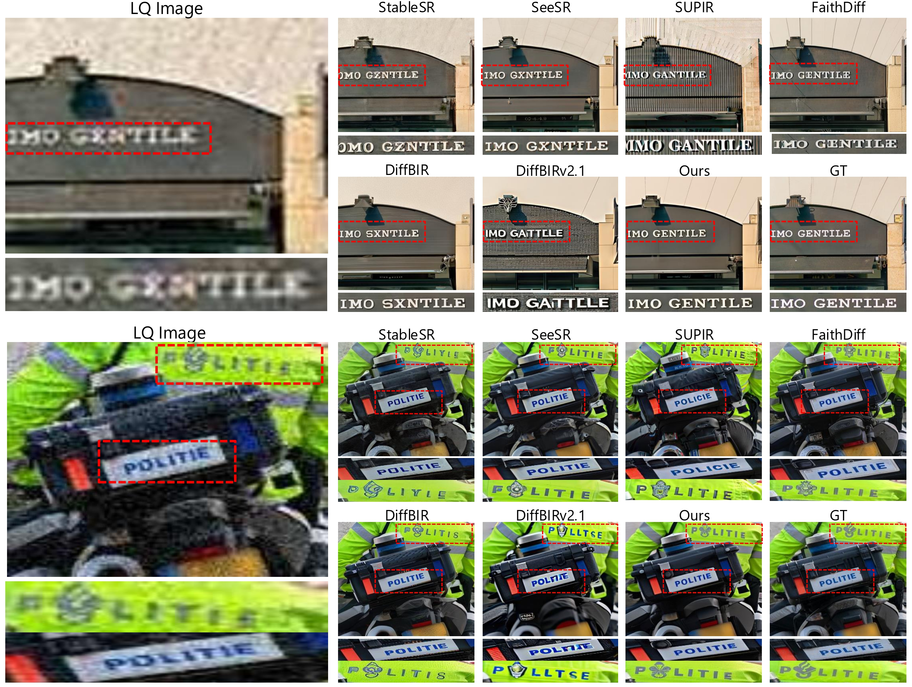

# Text-Aware Image Restoration with Diffusion Models

[Jaewon&nbsp;Min1*](https://github.com/Min-Jaewon/) · 
[Jin&nbsp;Hyeon&nbsp;Kim2*](https://github.com/jinlovespho) · 
Paul&nbsp;Hyunbin&nbsp;Cho1 · 
[Jaeeun&nbsp;Lee3](https://github.com/babywhale03) · 
Jihye&nbsp;Park4 · 
Minkyu&nbsp;Park4 · 
Sangpil&nbsp;Kim2† · 
Hyunhee&nbsp;Park4† · 
[Seungryong&nbsp;Kim1†](https://cvlab.kaist.ac.kr/)

1 KAIST&nbsp;AI ·
2 Korea&nbsp;University ·
3 Yonsei&nbsp;University ·
4 Samsung&nbsp;Electronics

    

<!-- * Equal&nbsp;contribution  † Corresponding&nbsp;authors -->

<!-- ### [Paper&nbsp;(Coming&nbsp;soon)](#) | [Project&nbsp;Page](https://cvlab-kaist.github.io/TAIR) -->

## 📢 News
- 🤗 **2025.06.19** — **SA-Text** and **Real-Text** datasets are released along with the [dataset pipeline](https://github.com/paulcho98/text_restoration_dataset/tree/main)!
- 📄 **2025.06.12** — Arxiv paper is released! 
- 🚀 **2025.06.01** — Official launch of the repository and project page!

## 💾 SA-Text Dataset
**SA-Text** is a newly proposed dataset for **Text-Aware Image Restoration (TAIR)** task. It is built from  **SA-1B** dataset using our [dataset pipeline](https://github.com/paulcho98/text_restoration_dataset/tree/main) and  consists of **100K** image-text instance pairs with detailed scene-level annotations.

**Real-Text** is an evaluation dataset for real-world scenarios. It is constructed from [RealSR](https://github.com/csjcai/RealSR) and [DrealSR](https://github.com/xiezw5/Component-Divide-and-Conquer-for-Real-World-Image-Super-Resolution) using same pipeline as above.

---

### Dataset Download

| Split             | Hugging Face 🤗 | Google Drive 📁 |
|------------------|:---------------:|:---------------:|
| **SA-Text**       | 
[Link](https://huggingface.co/datasets/Min-Jaewon/SA-Text)
 | 
[Link](https://drive.google.com/file/d/1fJugZYInTIWUj0tY_iSddwTwmQDAoO-5/view?usp=sharing)
 |
| **Real-Text**     | 
[Link](https://huggingface.co/datasets/Min-Jaewon/Real-Text)
 | 
[Link](https://drive.google.com/file/d/1sIjeFe0Rq6IvYEC-pkz6aQ4ubuIge4xi/view?usp=sharing)
 |

---

### Notes

- Each image is paired with one or more text instances with polygon-level annotations.
- The dataset follows a consistent annotation format, detailed in the [dataset pipeline](https://github.com/paulcho98/text_restoration_dataset/tree/main).
- We recommend using the dataset from Google Drive for testing our code.